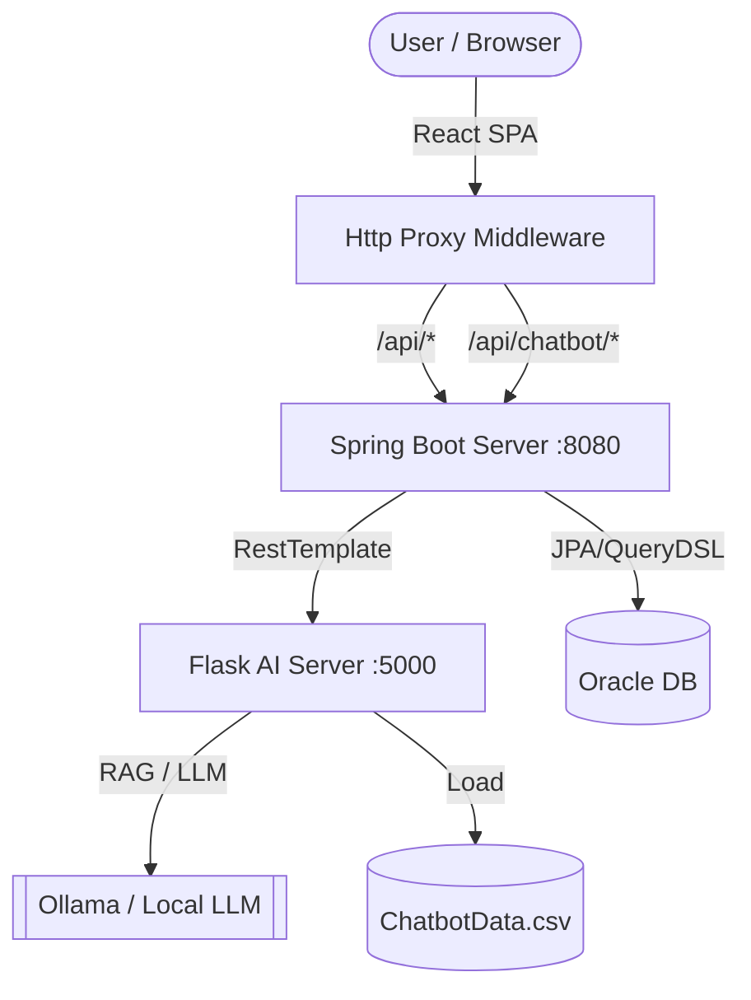

# 🚀 지능형 채용 관리 솔루션 (Intelligent ATS)

> **Spring Boot & Flask 하이브리드 아키텍처 기반의 RAG 챗봇 연동 채용 관리 시스템** > **개발 기간:** 2025.12.01 ~ 2026.01.27 (8주)  
> **Project Leader:** 이재현 (Full Stack & AI Integration)

---

## 📖 프로젝트 개요
기존 채용 플랫폼의 경직된 프로세스와 수작업의 비효율성을 해결하기 위해 개발된 **한국형 ATS(Applicant Tracking System)**입니다.  
기업별 맞춤형 전형 단계 설정부터 AI 기반 공고 작성 보조까지, 채용 담당자의 업무 효율을 극대화하는 것을 목표로 합니다.

### 💡 핵심 특화점
1.  **Hybrid Architecture**: 안정적인 Spring Boot(백엔드)와 유연한 Flask(AI 서빙)의 이종 서버 결합
2.  **AI RAG Chatbot**: 사내 데이터를 기반으로 직무 기술서(JD) 초안을 자동 생성 및 추천 (Gemma/Llama 모델 활용)
3.  **Dynamic Workflow**: 직관적인 UI로 전형 단계와 지원요구사항 문항을 자유롭게 커스터마이징

---

## 🛠 기술 스택 (Tech Stack)

| Category | Technology |
| --- | --- |
| **Frontend** | React 19, Bootstrap 5, Axios |
| **Backend (Main)** | Java 21, Spring Boot 3.5, Spring Security, JPA/Hibernate, QueryDSL |
| **Backend (AI)** | Python 3.10, Flask, Scikit-learn (TF-IDF), Ollama - gemma3:4b(LLM) |
| **Database** | Oracle Database 23ai free (RDBMS) |
| **Infrastructure** | Http-Proxy-Middleware (CORS 해결), Gradle, RESTful API |

---

## 🏗 시스템 아키텍처 (System Architecture)



---

## 💾 데이터베이스 설계 (ERD)


---

✨ 주요 기능 (Key Features)
1. 🤖 AI 채용 비서 (RAG Chatbot)

기능: 사용자의 자연어 요청("자바 백엔드 신입 공고 써줘")을 분석하여 직무 기술서 초안 생성

기술: TF-IDF 벡터 유사도 검색 + LLM(Gemma/Llama)을 활용한 RAG(검색 증강 생성) 구현

연동: React에서 생성된 초안을 공고 작성 폼에 원클릭 적용 가능


2. 📝 유연한 공고 관리 (Job Management)

커스텀 전형: 서류 → 코딩테스트 → 1차 면접 등 기업 상황에 맞춰 전형 단계 추가/삭제/순서 변경

UI/UX: 직관적인 UI 제공

상태 관리: 모집 중(OPEN) / 마감(CLOSED) 상태 관리 및 스케줄러를 통한 자동 마감 처리


3. 🔐 보안 및 인증 (Security)

권한 분리: 기업 담당자(Recruiter)와 구직자(Guest)의 접근 권한을 철저히 분리

하이브리드 통신 보안: React가 AI 서버에 직접 접근하지 않고, Spring Boot를 Gateway로 경유하여 보안성 강화

---

🔥 트러블 슈팅 (Troubleshooting)

이슈 1: 이종 서버(Spring-Flask) 간 CORS 및 통신 문제

문제: React(3000), Spring(8080), Flask(5000) 포트 불일치로 인한 CORS 에러 발생

해결:

개발 환경에서 http-proxy-middleware를 사용하여 모든 API 요청을 Proxy 처리

Spring Boot의 ChatController가 Flask로의 요청을 중계(Relay)하는 API Gateway 패턴 적용

클라이언트는 Spring하고만 통신하도록 단일화하여 보안 및 세션 관리 문제 해결

이슈 2: 동적 입력 폼 데이터의 정합성 유지

문제: 사용자가 임의로 추가/삭제하는 전형 단계(JobStep)와 질문(JobQuestion)의 순서(Order)가 DB 저장 시 꼬이는 현상

해결:

프론트엔드 종료 시점에 배열 인덱스를 기준으로 order 필드 재계산

JobReorderRequestDto를 통해 변경된 ID 리스트를 서버로 전송하고, @Modifying 쿼리로 일괄 업데이트

---

## 📂 프로젝트 구조 (Project Structure)

### 1. AtsProject-Ats (Main Service)
```bash
AtsProject-Ats
├── ☕ backend (Spring Boot)
│   ├── src/main/java/min/boot/ats
│   │   ├── component   # JobScheduler
│   │   ├── config      # Security, QueryDSL, Password 설정
│   │   ├── control     # REST API Controller
│   │   ├── domain      # JPA Entity
│   │   ├── dto         # Request/Response DTO
│   │   ├── repo        # Repository & Custom QueryDSL
│   │   └── service     # 비즈니스 로직
│   └── build.gradle
│
└── ⚛️ front (React)
    ├── src
    │   ├── api         # Axios 인스턴스 설정
    │   ├── components  # Chatbot
    │   ├── context     # AuthContext (로그인 상태 관리)
    │   ├── pages       # 주요 페이지
    │   └── setupProxy.js # Proxy 설정
    └── package.json
```

### 2. AtsProject-Chatbot (AI Microservice)
```bash
AtsProject-Chatbot
├── 🐍 ai-server (Flask)
│   └── myApp
│       └── app.py      # Flask 서버 진입점 & RAG 로직
└── data            # 학습용 데이터셋 (ChatbotData.csv, 답변 실패 로그 파일 포함)
```

---


