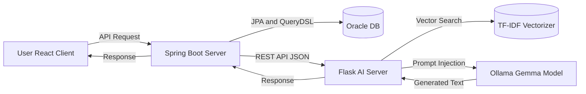

# 🚀 Ats (Intelligent ATS Solution)
> **Spring Boot & Flask 하이브리드 아키텍처 기반의 지능형 채용 관리 솔루션**
> *Spring Boot & Flask Hybrid Architecture based Intelligent ATS*

 
 
 
 


## 📖 프로젝트 개요 (Overview)
**Ats**는 한국 기업의 채용 프로세스에 특화된 **올인원 채용 관리 시스템**입니다.  
기존 채용 플랫폼의 문제점인 **'경직된 채용 프로세스'**와 **'반복적인 공고 작성 업무'**를 해결하기 위해 개발되었습니다. 
기업은 전형 단계(Step)를 상황에 맞춰 자유롭게 커스터마이징 할 수 있으며, **RAG(검색 증강 생성) 기반의 AI 비서**를 통해 직무에 최적화된 공고를 자동 생성할 수 있습니다.

### 🎯 핵심 목표 (Goals)
* **Process Innovation:** 정형화된 채용 단계를 넘어선 유연한 프로세스 설계 (Custom Workflow).
* **Work Efficiency:** RAG AI 기술을 활용한 공고 작성 및 직무 기술서 자동화.
* **Hybrid Tech:** Spring Boot의 대용량 트래픽 처리 능력과 Flask의 유연한 AI 확장성을 결합.

---

## 🎥 프로젝트 시연 (Demo)

### [핵심 기능] AI 공고 자동 생성 및 원클릭 적용
> **아래 링크를 클릭하면 고화질 시연 영상을 확인할 수 있습니다.**

https://github.com/user-attachments/assets/67e3294b-aa00-4dab-badf-a5c9823524ba

---

## 🏗 시스템 아키텍처 (System Architecture)

**Spring Boot(Main Backend)**와 **Flask(AI Server)**를 분리하여 각 서버의 장점을 극대화한 **하이브리드 아키텍처**입니다.



---

## 💡 주요 기능 및 기술적 특징 (Key Features)

### 1. 🤖 RAG 기반 AI 채용 비서 (AI Assistant)
* **문제 해결:** 범용 LLM의 환각(Hallucination) 현상을 방지하고, 직무와 관련된 정확한 정보를 제공하기 위해 **RAG(Retrieval-Augmented Generation)** 방식을 도입했습니다.
* **구현 원리:**
    1.  사전에 구축된 IT 직무 데이터셋(CSV)을 `TF-IDF`로 벡터화하여 저장.
    2.  사용자 질문 발생 시 `Cosine Similarity`로 가장 유사한 직무 데이터를 검색(Retrieval).
    3.  검색된 문맥(Context)을 프롬프트에 주입하여 Gemma 모델이 답변 생성.
* **UX 최적화:** 챗봇이 생성한 내용을 사용자가 복사/붙여넣기 할 필요 없이, **[적용하기]** 버튼 클릭 시 React의 Form 상태값에 자동 매핑되는 편의 기능 제공.

### 2. 📝 동적 채용 프로세스 설계 (Custom Workflow)
* **기능:** 공고별로 전형 단계(서류 → 1차 면접 → 코딩 테스트 → 최종 면접 등)를 기업의 상황에 맞춰 자유롭게 추가, 삭제, 순서 변경이 가능합니다.
* **기술:** `Jobs` Entity와 `JobSteps` Entity 간의 **1:N 연관관계** 및 JPA의 `orphanRemoval` 옵션을 활용하여 데이터 생명주기를 완벽하게 동기화했습니다.

### 3. 🔍 QueryDSL 기반 동적 검색 (Dynamic Search)
* **기능:** 지역, 직무 카테고리, 고용 형태, 키워드 등 다양한 조건의 복합 필터링 검색을 지원합니다.
* **기술:** QueryDSL의 `BooleanBuilder`와 `BooleanExpression`을 사용하여, 조건 유무에 따라 쿼리가 동적으로 변하는 **Null-Safe**하고 성능 최적화된 검색 로직을 구현했습니다.

### 4. 🔐 보안 및 이종 서버 통신 (Security & Networking)
* **CORS 해결:** 개발 환경(React:3000, Spring:8080) 간의 통신 문제를 해결하기 위해 `http-proxy-middleware`를 도입하고 세션 쿠키 공유 설정을 적용했습니다.
* **서버 간 통신:** Java Spring에서 Python Flask로 데이터 요청 시 `RestTemplate`을 사용하여 JSON 기반의 REST 통신 파이프라인을 구축했습니다.

---

## 🛠 기술 스택 (Tech Stack)

| 구분 | 기술 스택 | 비고 |
| :--- | :--- | :--- |
| **Backend** | **Spring Boot 3.5.9**, Java 21 | Core API Server |
| **Database** | **Oracle Database 21c**, JPA, **QueryDSL 5.0** | Data Persistence |
| **Frontend** | **React 19**, Axios, Bootstrap 5 | SPA Architecture |
| **AI Server** | **Python Flask**, Scikit-learn | RAG & Vector Search |
| **LLM** | **Ollama (gemma3:4b)** | On-premise LLM |
| **Security** | Spring Security | Auth & Password Encoding |
| **Tools** | Gradle, Git, Postman | Build & Collaboration |

---

## 💾 데이터베이스 모델링 (ERD Summary)

* **USERS:** 사용자 계정 정보 (관리자, 채용담당자, 일반회원 - Role 기반 권한 관리)
* **COMPANIES:** 채용을 진행하는 기업 정보 (USERS와 연동)
* **JOBS:** 채용 공고 메인 엔티티
* **JOB_STEPS:** 공고별 커스텀 전형 단계 (순서 및 메타데이터 포함)
* **JOB_QUESTIONS:** 공고별 지원자 사전 질문 리스트

---

## 🚀 시작 가이드 (Getting Started)

이 프로젝트를 로컬 환경에서 실행하기 위한 가이드입니다.

### Prerequisites
* **Java 21** & **JDK**
* **Node.js** (v18+) & **npm**
* **Python 3.12+**
* **Oracle Database** (localhost:1521)
* **Ollama** (Model: `gemma3:4b` pull 완료 필수)

### 1. Backend (Spring Boot)
```bash
# Repository Clone
git clone https://github.com/LeeJaeHyun-git/Ats.git
cd Ats

# application.yml 설정 (DB 계정 정보 수정)
# 빌드 및 실행
./gradlew bootRun
